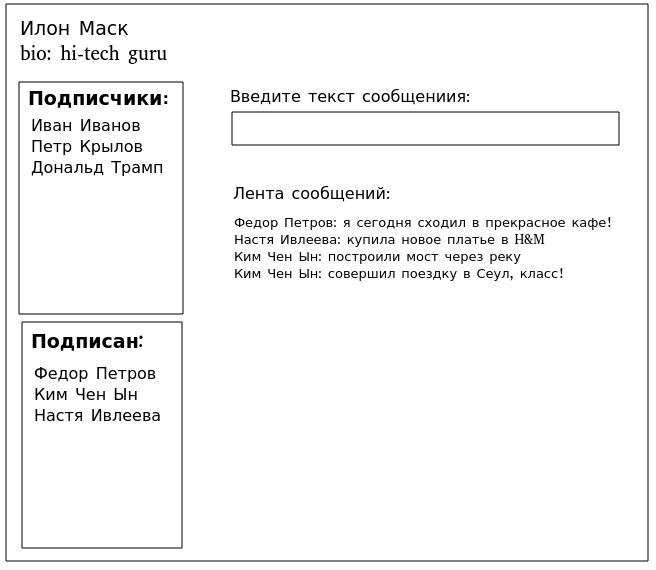
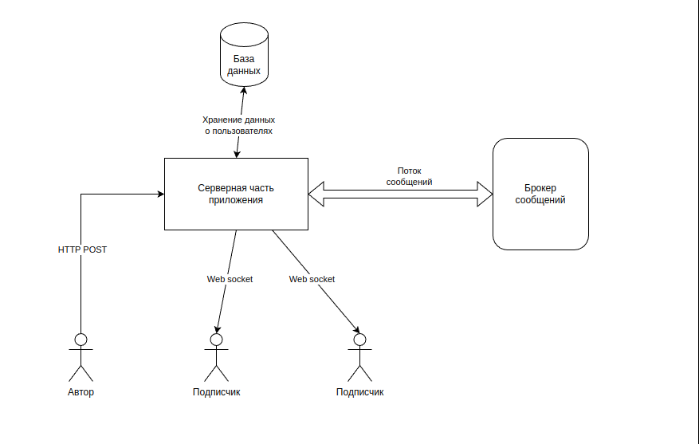

# Название проекта 
birds app

## Краткое описание сути 
приложение обмена короткими сообщениями

## Целевая аудитория 
студенты и выпускники вузов, от 18 до 22 лет

## Портрет пользователя
студент, обладающий смартфоном, интересующийся технологиями, с активной жизненной позицией

## Описание MVP
Пользователь открывает страницу приложения. На странице присутсвует Форма ввода
короткого (140 символов) сообщения. У Пользователя есть подписчики и список авторов, которых он читает.  
Пользователь вводит сообщение в Форму отправки и нажимает кнопку Отправить.  
После этого, в реальном времени, в Ленте подписчиков появляется данное сообщение

## Эскиз интерфейса

## Описание сущностей MVP
Пользователь - автор собственных сообщений, читатель сообщений от других людей.
Пост - короткое сообщение Пользователя размером не более 140 символов.
Лента - список Постов, которые написали другие Авторы.

## Обобщенная архитектура проекта
