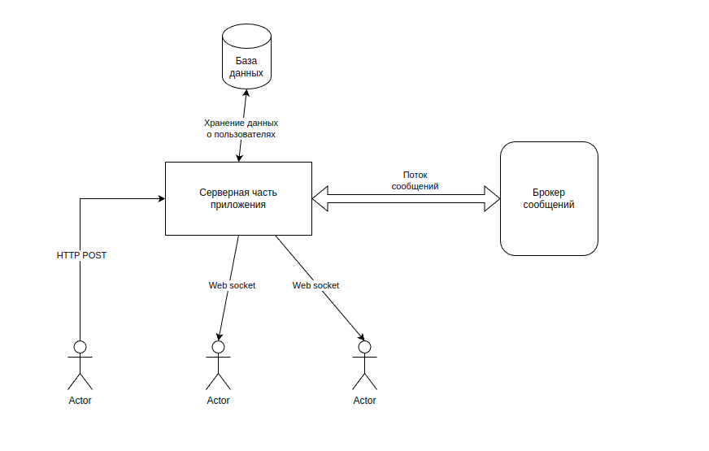

# Название проекта 
birds app

## Краткое описание сути 
приложение обмена короткими сообщениями

## Целевая аудитория 
человек молодого и среднего возраста от 25 до 45 лет

## Портрет пользователя
человек, обладающий смартфоном, интересующийся технологиями, с активной жизненной позицией
Описание MVP: пользователь открывает страницу приложения. На странице приложения есть 2 списка людей -  
на которых он подписан, которые подписаны на него. Также на странице присутсвует описание профиля и форма ввода 
короткого сообщения. Размер сообщения ограничен 140 символами. Также на главной странице отображаются сообщения,  
которые написали пользователи на которых он подписан. Сообщения отображаются в реальном времени,  
без обновления страницы

## Эскиз интерфейса

## Описание сущностей приложения
Пользователь приложения - тот, для кого создается приложение
Подписка на пользователя - возможность одного пользователя читать посты другого
Пост - короткое сообщение пользователя размером не более 140 символов
Подписчик - пользователь, который подписан на другого пользователя
Лента пользователя - посты, которые написали пользователи, на которых он подписан 

## Обобщенная архитектура проекта

